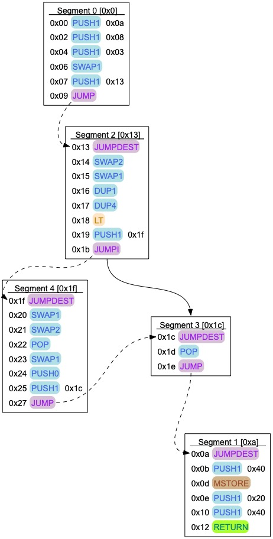

[](https://opensource.org/licenses/Apache-2.0)
[](https://code.visualstudio.com/)
[](https://shields.io/)

# Overview

This project provides an EVM bytecode _disassembler_ and Control Flow Graph (CFG) generator.
The disassembler should support the latest opcodes like `PUSH0`, [EIP-3855](https://eips.ethereum.org/EIPS/eip-3855), and `RJump`s, [EIP-4200](https://eips.ethereum.org/EIPS/eip-4200).
The disassembler takes as an input some _binary representation_, EVM bytecode, and produces a _readable version_ of it. 
For instance the following binary string,  `prog` : 
```
600a6008600390600f565b604052005b9190808310601b575b50565b909150905f601856
```
is disassembled into the more readable (but arguably still opaque!) EVM assembly code, left-hand side below, and
the CFG is depicted on the right-hand side. 

<center>
<table>
<tr>
<th style="text-align:center">EVM Assembly &nbsp &nbsp &nbsp</th>
<th></th>
<th style="text-align:center">Control Flow Graph</th>
</tr>
<tr>
<td>

```
0x00: PUSH1 0x0a
0x02: PUSH1 0x08
0x04: PUSH1 0x03
0x06: SWAP1
0x07: PUSH1 0x0f
0x09: JUMP
0x0a: JUMPDEST
0x0b: PUSH1 0x40
0x0d: MSTORE
0x0e: STOP
0x0f: JUMPDEST
0x10: SWAP2
0x11: SWAP1
0x12: DUP1
0x13: DUP4
0x14: LT
0x15: PUSH1 0x1b
0x17: JUMPI
0x18: JUMPDEST
0x19: POP
0x1a: JUMP
0x1b: JUMPDEST
0x1c: SWAP1
0x1d: SWAP2
0x1e: POP
0x1f: SWAP1
0x20: PUSH0
0x21: PUSH1 0x18
0x23: JUMP
```
</td>
<td>&nbsp &nbsp &nbsp &nbsp &nbsp &nbsp &nbsp</td>
<td>
<figure>
  
</figure>
</td>
</tr>
</table>
</center>

The CFG generator uses a combination of abstract interpretation, loop folding (using weakest pre-conditions) and automata minimisation. 
It can re-construct CFGs with nested loops, function calls.

Examples of CFGS in DOT format for the an ERC-20, the Deposit Contract and some other programs are available in the [test folder](./src/dafny/tests/src/).
You can use the [Graphviz-Online](https://dreampuf.github.io/GraphvizOnline/) tool to visualise them.

## Usage
The disassembler generates readable EVM assembly and the CFG generator DOT files.
The input to the disassembler and CFG generator is the deployed (`bin-runtime`) part of the compiled code if you compile Solidity with `solc`.

For the examples in the repo I have used Yul and `solc --yul` to get a text representation of the Yul code that includes the _binary representation_ hexadecimal  string. 

The Dafny proof object feature is experimental.

Dafny code can be used to generate some target code in several languages. To begin with we have generated
Python, Java, JS (new!) and C# (Dotnet) code.
So you don't need to install Dafny to use the disassembler, you can run the Python or java versions provided in the `build/libs`.

### Using the Python version of the disassembler/CFG generator
The Python disassembler is in `build/driver-py`.

It can be used with an input string as follows:
```zsh
evm-dis git:(main) ✗ python3 build/libs/driver-py/__main__.py                 
Not enough arguments
usage: <this program>  [--help]  [--dis]  [--proof]  [--segment]  [--all]  [--lib]  arg0 [--cfg]  arg0 [--raw]  arg0 <string>

options
--help      [-h] Display help and exit
--dis       [-d] Disassemble <string>
--proof     [-p] Generate proof object for <string>
--segment   [-s] Print segment of <string>
--all       [-a] Same as -d -p
--lib       [-l] The path to the Dafny-EVM source code. Used to add includes files in the proof object. 
--cfg       [-c] Max depth. Control flow graph in DOT format
--raw       [-r] Display non-minimised and minimised CFGs

evm-dis git:(main) ✗ python3 build/libs/driver-py/__main__.py  "6040"
PUSH1 0x40
```
To parse a binary representation from a file `file.evm` use:
```zsh
evm-dis git:(main) ✗ python3 build/libs/driver-py/__main__.py $(<file.evm)
PUSH1 0x40
```

To generate a Dafny proof object (only usable with the [Dafny-EVM](https://github.com/Consensys/evm-dafny)):

```zsh
evm-dis git:(main) ✗ python3 build/libs/driver-py/__main__.py  -p "6040"      
/** Code starting at 0x0 */
function ExecuteFromTag_0(s0: EvmState.ExecutingState): (s': EvmState.State)
  requires s0.PC() == 0x0 as nat
  requires s0.Operands() >= 0
  requires s0.Capacity() >= 1
{
  ValidJumpDest(s0);
  var s1 := Push1(s0, 0x40);
  s1
}
```

### Using the Java version of the disassembler/CFG generator

The java disassembler is the file `evmdis.jar` in  `build/libs/Driver-java`.
It can be used with an input string as follows:
```zsh
evm-dis git:(main) ✗ java -jar build/libs/Driver-java/evmdis.jar              
Not enough arguments
usage: <this program>  [--help]  [--dis]  [--proof]  [--segment]  [--all]  [--lib]  arg0 [--cfg]  arg0 [--raw]  arg0 <string>

options
--help      [-h] Display help and exit
--dis       [-d] Disassemble <string>
--proof     [-p] Generate proof object for <string>
--segment   [-s] Print segment of <string>
--all       [-a] Same as -d -p
--lib       [-l] The path to the Dafny-EVM source code. Used to add includes files in the proof object. 
--cfg       [-c] Max depth. Control flow graph in DOT format
--raw       [-r] Display non-minimised and minimised CFGs

evm-dis git:(main) ✗ java -jar build/libs/Driver-java/evmdis.jar "6040"
PUSH1 0x40
```
To parse a binary representation from a file `file.evm` use:
```zsh
evm-dis git:(main) ✗ java -jar build/libs/Driver-java/evmdis.jar $(<file.evm)
PUSH1 0x40
```
To generate a Dafny proof object (only usable with the [Dafny-EVM](https://github.com/Consensys/evm-dafny)):
```zsh
evm-dis git:(main) ✗ java -jar build/libs/Driver-java/evmdis.jar -p "6040"    

/** Code starting at 0x0 */
function ExecuteFromTag_0(s0: EvmState.ExecutingState): (s': EvmState.State)
  requires s0.PC() == 0x0 as nat
  requires s0.Operands() >= 0
  requires s0.Capacity() >= 1
{
  ValidJumpDest(s0);
  var s1 := Push1(s0, 0x40);
  s1
}

```

### Using the C#/Dotnet version of the disassembler/CFG generator

The C# version (`.dll`) is run using `dotnet` as follows:

```zsh
evm-dis git:(main) ✗ dotnet build/libs/driver.dll
Not enough arguments
usage: <this program>  [--help]  [--dis]  [--proof]  [--segment]  [--all]  [--lib]  arg0 [--cfg]  arg0 [--raw]  arg0 <string>

options
--help      [-h] Display help and exit
--dis       [-d] Disassemble <string>
--proof     [-p] Generate proof object for <string>
--segment   [-s] Print segment of <string>
--all       [-a] Same as -d -p
--lib       [-l] The path to the Dafny-EVM source code. Used to add includes files in the proof object. 
--cfg       [-c] Max depth. Control flow graph in DOT format
--raw       [-r] Display non-minimised and minimised CFGs
```

### Using the JS version of the disassembler/CFG generator
The JS disassembler is in `build/driver.js`.

```zsh
evm-dis git:(main) ✗ node build/driver.js
Not enough arguments
usage: <this program>  [--help]  [--dis]  [--proof]  [--segment]  [--all]  [--lib]  arg0 [--cfg]  arg0 [--raw]  arg0 <string>

options
--help      [-h] Display help and exit
--dis       [-d] Disassemble <string>
--proof     [-p] Generate proof object for <string>
--segment   [-s] Print segment of <string>
--all       [-a] Same as -d -p
--lib       [-l] The path to the Dafny-EVM source code. Used to add includes files in the proof object. 
--cfg       [-c] Max depth. Control flow graph in DOT format
--raw       [-r] Display non-minimised and minimised CFGs
```


## An EVM bytecode disassembler in Dafny

The disassembler and CFG generator is written in [Dafny](https://github.com/dafny-lang/dafny) a verification-friendly programming language.
Some code (e.g. the definition of `EVMOpcodes`, `Int`) is adapted from the [Dafny-EVM](https://github.com/Consensys/evm-dafny) project.

## Motivations

The disassembler/CFG generator is a useful tool but not the ultimate goal of this project.
The main component, `Disassemble`, builds a representation of the binary as a sequence of `Instructions`.
This representation can be _printed out_ (this is how the disassembler generates the readable code), but also used to generate _proof objects_ that are Dafny programs that can be _verified_ using the [Dafny-EVM](https://github.com/Consensys/evm-dafny).

As an example, the following  [Yul](https://docs.soliditylang.org/en/latest/yul.html) code (the same can be done with Solidity code):
```solidity
object "Runtime" {
  code {
    function checked_add_t_uint256(x, y) -> sum {
        sum := add(x, y)
        if gt(x, sum) { revert(0, 0) }
    }

    let x := 8
    let y := 56
    let z := checked_add_t_uint256(x, y)
  }
}
```
can be compiled using `solc --yul` into an (EVM) binary representation, and the result is the string `prog` given above.

The disassembler we build here will ultimately be used to generate a Dafny program to verify some properties of the previous code.
From the binary representation `prog` we want to _automatically_ build a [Dafny-EVM](https://github.com/Consensys/evm-dafny) friendly program similar to the `OverFlowCheckerBytecode` below.
This program can be used to _reason_ about the bytecode, thanks to the formal semantics provided by the  [Dafny-EVM](https://github.com/Consensys/evm-dafny) and the verification engine embedded in [Dafny](https://github.com/dafny-lang/dafny).

```rust
module OverFlowCheckerBytecode {

  import opened Int
  import EvmState
  import opened Bytecode

  /**
    *  The labels (JUMPDEST) in the bytecode.
    */
  const tag_1: u8 := 0x0c
  const tag_2: u8 := 0x0d
  const tag_3: u8 := 0x18
  const tag_4: u8 := 0x17                   //   this one is not a JUMPDEST

  /**
    *  When a JUMP or JUMPI is executed we need to make sure the target location 
    *  is a JUMPDEST.
    *  This axiom enforces it.
    */
  lemma {:axiom} ValidJumpDest(s: EvmState.ExecutingState)
    ensures s.IsJumpDest(tag_1 as u256)
    ensures s.IsJumpDest(tag_2 as u256)
    ensures s.IsJumpDest(tag_3 as u256)

  /**
    *  Code starting at PC == 0.
    */
  function ExecuteFromZero(st: EvmState.ExecutingState): (s': EvmState.State)
    requires st.Capacity() >= 4
    requires st.Operands() >= 0
    requires st.PC() == 0 as nat

    ensures s'.EXECUTING?
    ensures s'.PC() == tag_1 as nat
  {
    /*
    00000000: PUSH1 0xa     //  tag_2 
    00000002: PUSH1 0x8
    00000004: PUSH1 0x38
    00000006: SWAP1
    00000007: PUSH1 0xc     //  tag_1 
    00000009: JUMP
    */
    ValidJumpDest(st);
    var s1 := Push1(st, tag_2);
    var s2 := Push1(s1, 0x08);
    var s3 := Push1(s2, 0x38);
    var s4 := Swap(s3, 1);
    assert s4.Peek(2) == tag_2 as u256;
    var s5 := Push1(s4, tag_1);
    assert s5.Peek(3) == tag_2 as u256;
    var s6 := Jump(s5);
    s6
  }

  /**
    * Code staring at tag_2
    */
  function ExecuteFromTag2(st: EvmState.ExecutingState): (s': EvmState.State)
    requires st.Capacity() >= 0
    requires st.Operands() >= 0
    requires st.PC() == tag_2 as nat

    ensures s'.RETURNS?
    ensures |s'.data| == 0
  {
    /*
    0000000b: STOP
    */
    var s6 := Stop(st);
    s6
  }

  /**
    * Code staring at tag_1
    */
  function ExecuteFromTag1(st: EvmState.ExecutingState): (s': EvmState.State)
    requires st.Capacity() >= 1
    requires st.Operands() >= 3
    requires st.PC() == tag_1 as nat
    requires st.Peek(2) == tag_3 as u256

    ensures s'.EXECUTING?
    ensures s'.Operands() == st.Operands() - 1
    ensures s'.Peek(0) == st.Peek(2)
    ensures s'.Peek(1) as nat == (st.Peek(0) as nat + st.Peek(1) as nat) % TWO_256
    ensures s'.PC() == if st.Peek(0) > ((st.Peek(0) as nat + st.Peek(1) as nat) % TWO_256) as u256 then tag_3 as nat else tag_4 as nat
  {
    /*
    0000000c: JUMPDEST      //  tag_1
    0000000d: SWAP2
    0000000e: SWAP1
    0000000f: DUP3
    00000010: ADD
    00000011: DUP1
    00000012: SWAP3
    00000013: GT
    00000014: PUSH1 0x18    //  tag_3 
    00000016: JUMPI
    */
    ValidJumpDest(st);
    var s1 := JumpDest(st);             //  x, y, z
    var s2 := Swap(s1, 2);              //  z, y, x
    var s3 := Swap(s2, 1);              //  y, z, x
    var s4 := Dup(s3, 3);               //  x, y, z, x
    var s5 := Add(s4);                  //  x + y, z, x
    var s6 := Dup(s5, 1);               //  x + y, x + y, z, x
    var s7 := Swap(s6, 3);              //  x, x + y, z, x + y
    assert s7.Peek(0) == st.Peek(0);
    var s8 := Bytecode.Gt(s7);          //  x > x + y, z, x + y
    var s9 := Push1(s8, tag_3);         //  tag_3, x > x + y, z, x + y
    var s10 := JumpI(s9);               //  z, x + y
    s10
  }

  /**
    * Code staring at tag_3
    */
  function ExecuteFromTag3(st: EvmState.ExecutingState): (s': EvmState.State)
    requires st.Operands() >= 0
    requires st.Capacity() >= 2
    requires st.PC() == tag_3 as nat

    ensures s'.ERROR?
  {
    /*
    00000018: JUMPDEST      //  tag_3 
    00000019: PUSH0
    0000001a: DUP1
    0000001b: REVERT
    */
    ValidJumpDest(st);

    var s1 := JumpDest(st);
    var s2 := Push0(s1);
    var s3 := Dup(s2, 1);

    var s4 := Revert(s3);
    s4
  }

  /**
    * Code staring at tag_3
    */
  function ExecuteFromTag4(st: EvmState.ExecutingState): (s': EvmState.State)
    requires st.Operands() >= 1
    requires st.Capacity() >= 0
    requires st.PC() == tag_4 as nat
    requires st.Peek(0) in {tag_1 as u256, tag_2 as u256, tag_3 as u256}

    ensures s'.EXECUTING?
    ensures s'.PC() == st.Peek(0) as nat
    ensures s'.Operands() == st.Operands() - 1
  {
    /*
    00000017: JUMP
    */
    ValidJumpDest(st);
    // assume st.IsJumpDest(st.Peek(0));
    Jump(st)
  }
}
```

