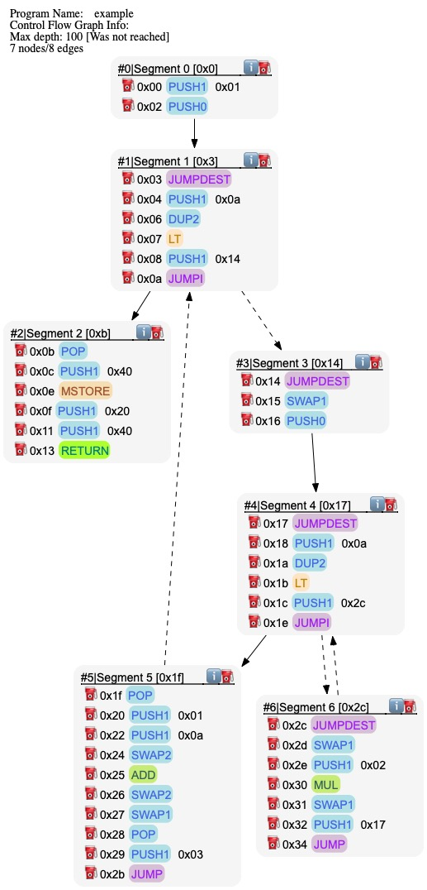

[](https://opensource.org/licenses/Apache-2.0)
[](https://code.visualstudio.com/)
[](https://shields.io/)

This is ByteSpector, a tool to analyse EVM bytecode. A quick preview of what ByteSpector can do is available at [https://bytespector.org](https://bytespector.org).

# Overview

This project provides an EVM bytecode _disassembler_ and Control Flow Graph (CFG) _generator_.
The disassembler should support the latest opcodes like `PUSH0`, [EIP-3855](https://eips.ethereum.org/EIPS/eip-3855), and is ready for `RJump`s (but not fully implemented yet), [EIP-4200](https://eips.ethereum.org/EIPS/eip-4200).

### Disassembler

The disassembler takes as an input some _binary representation_, EVM bytecode, and produces a _readable version_ of it.
For instance the following binary string,  `prog` :

```
60015f5b600a81106014575060405260206040f35b905f5b600a8110602c57506001600a91019190506003565b9060020290601756
```

is disassembled into the more readable (but arguably still opaque!) EVM assembly code, left-hand side below, and
the CFG is depicted on the right-hand side.

<center>
<table>
<tr>
<th style="text-align:center">EVM Assembly &nbsp &nbsp &nbsp</th>
<th></th>
<th style="text-align:center">Control Flow Graph</th>
</tr>
<tr>
<td>

```
0x00: PUSH1 0x01
0x02: PUSH0

0x03: JUMPDEST
0x04: PUSH1 0x0a
0x06: DUP2
0x07: LT
0x08: PUSH1 0x14
0x0a: JUMPI

0x0b: POP
0x0c: PUSH1 0x40
0x0e: MSTORE
0x0f: PUSH1 0x20
0x11: PUSH1 0x40
0x13: RETURN

0x14: JUMPDEST
0x15: SWAP1
0x16: PUSH0

0x17: JUMPDEST
0x18: PUSH1 0x0a
0x1a: DUP2
0x1b: LT
0x1c: PUSH1 0x2c
0x1e: JUMPI

0x1f: POP
0x20: PUSH1 0x01
0x22: PUSH1 0x0a
0x24: SWAP2
0x25: ADD
0x26: SWAP2
0x27: SWAP1
0x28: POP
0x29: PUSH1 0x03
0x2b: JUMP

0x2c: JUMPDEST
0x2d: SWAP1
0x2e: PUSH1 0x02
0x30: MUL
0x31: SWAP1
0x32: PUSH1 0x17
0x34: JUMP
```

The script `disassemble.sh` provides a simple way to disassemble the bytecode.

```zsh
evm-dis git:(main) ✗ ./disassemble.sh <file> 
```

</td>
<td>&nbsp &nbsp &nbsp &nbsp &nbsp &nbsp &nbsp</td>
<td>
<figure>
  
</figure>
</td>
</tr>
</table>
</center>

### CFG Generator

The CFG generator outputs a DOT representation of the graph. Hovering some items (segments) reveals some information about the instructions, their gas cost, and for the segment about their _stack effects_.

The generator uses a combination of abstract interpretation, loop folding (using weakest pre-conditions) and automata minimisation. It can re-construct CFGs with nested loops, function calls.

Examples of CFGs in DOT format and SVG format are available in the [test folder](./src/dafny/tests/src/).
A front end is provided at [https://bytespector.org](https://bytespector.org) or alternatively,
you can use the [Graphviz-Online](https://dreampuf.github.io/GraphvizOnline/) tool to visualise the `dot` files.

## Usage

The input to the disassembler and CFG generator is the deployed (`bin-runtime`) part of the compiled code if you compile Solidity with `solc`.

For the examples in the repo I have used Yul and `solc --yul` to get a text representation of the Yul code that includes the _binary representation_ hexadecimal  string.

The CFGs can be _formally verified_ using a Dafny proof object.

The project is written in Dafny but Dafny's backends can be used to generate some target code in several languages. To begin with we have generated artefacts in **Python, Java and **C#** (Dotnet) code.
So you don't need to install Dafny to use the disassembler, you can run the Python or java versions provided in the `build/libs`.

### Disassemble the bytecode in a file

To disassemble the bytecode in a given file `file.evm` use the following command:

```zsh
evm-dis git:(main) ✗ ./disassemble.sh file.evm
```

### Generate the CFG in DOT format

To generate the CFG in DOT format for the bytecode in a file `file.evm` use the following command:

```zsh
evm-dis git:(main) ✗ ./makeCFG.sh src/dafny/tests/src/simple/simpleCall.bin
Processing file:  src/dafny/tests/src/simple/simpleCall.bin
Max depth size: 100
Shortname:  simpleCall.bin
CFG (DOT) format generared in build/dot/simpleCall.bin/simpleCall.bin.dot
```

### Generate the CFG verifier (Dafny code)

To generate the Dafny verifier for the bytecode in a file `file.evm` use the following command:

```zsh
evm-dis git:(main) ✗ ./makeProofObj.sh 'src/dafny/tests/src/simple/simpleCall.bin'
Processing file:  src/dafny/tests/src/simple/simpleCall.bin
Shortname:  simpleCall // resulting file:  build/proofs/simpleCall/simpleCall-cfg-verifier.dfy
seg size: 20
```

If you have Dafny installed (recommended Dafny 4.8.1), you can verify the generated Dafny code using the following command:

```zsh
evm-dis git:(main) ✗ dafny --version
4.8.1+d15eef77080d3262d783bbed92b285bf148cce6b
evm-dis git:(main) ✗ dafny verify build/proofs/simpleCall/simpleCall-cfg-verifier.dfy

Dafny program verifier finished with 3 verified, 0 errors
```

### More usage

You can view the options of the disassembler using:

```zsh
evm-dis git:(main) ✗ ./run-evm-dis.sh --help
Not enough arguments
usage: <this program>  [--help]  [--dis]  [--proof]  arg0 [--refine]  arg0 [--segment]  [--lib]  arg0 [--cfg]  arg0 [--raw]  [--size]  arg0 [--notable]  [--title]  arg0 [--info]  <string>

options
--help      [-h] Display help and exit
--dis       [-d] Disassemble <string>
--proof     [-p] Generate proof object to verify/use the CFG for <string>
--refine    [-e] Generate proof object with distinct segments <string>
--segment   [-s] Print segment of <string>
--lib       [-l] The path to the Dafny-EVM source code. Used to add includes files in the proof object. 
--cfg       [-c] Max depth. Control flow graph in DOT format
--raw       [-r] Display non-minimised and minimised CFGs
--size      [-z] The max size of segments. Default is upto terminal instructions or JUMPDEST.
--notable   [-n] Don't use tables to pretty-print DOT file. Reduces size of the DOT file.
--title     [-t] The name of the program.
--info      [-i] The stats of the program (size, segments).
```

## Benchmarks

ByteSpector can re-construct CFGs and verify them for a large number of deployed contracts.
For example, we have used it on the list `less_than_3000_opcodes.txt` from [EVMLisa](https://github.com/lisa-analyzer/evm-lisa).
Out of the 1704 contracts (addresss) in `less_than_3000_opcodes.txt`, 979 contracts were successfully disassembled and CFGs generated. The remaining 725 contracts were not disassembled due to the presence of `RJUMP`s in the bytecode which is not fully implemented yet.

The bytecode for the benchmarks contracts is in the [.etherscan](./etherscan) folder.
The corresponding CFGs are in the [./build/dot/etherscan](./build/dot/etherscan) folder.
The verification files (`.dfy`) and the verification results (`*-stats.csv`) are in the [./build/proofs/etherscan](./build/proofs/etherscan) folder.

### Useful Resources

- [Compile Dafny to other languages](https://github.com/dafny-lang/dafny/wiki/INSTALL/e488d7fec693266b206a6775feaff328c9c08f13#compiling-dafny)
- [Installation instructions Dafny](https://dafny.org/dafny/Installation#compiling-dafny)
